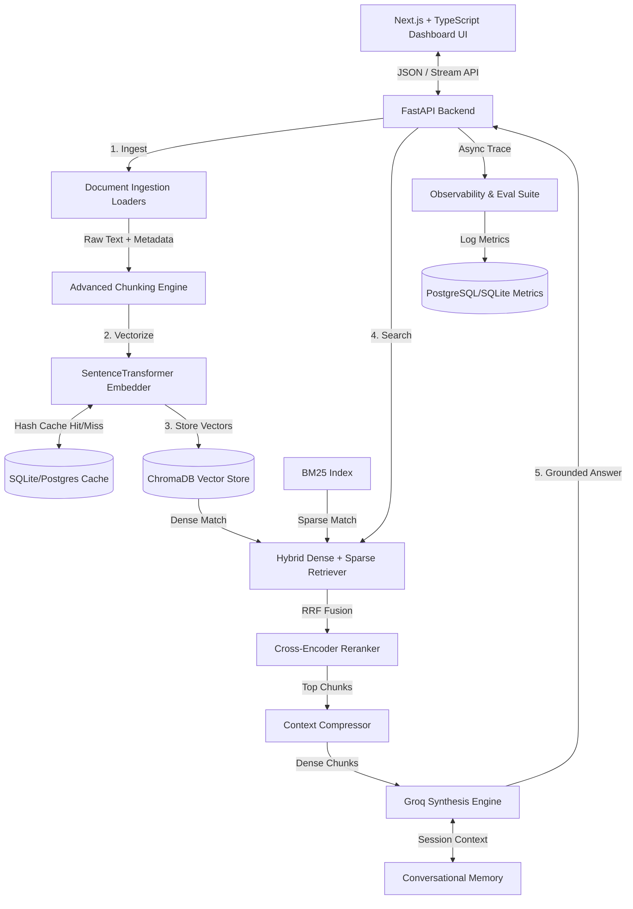

# Enterprise Knowledge Intelligence Platform

A state-of-the-art, production-ready Retrieval-Augmented Generation (RAG) platform designed to ingest, segment, index, search, and synthesize enterprise document repositories. 

Designed on **Clean Architecture SOLID principles**, this platform couples a high-speed Python FastAPI backend with a beautiful Next.js + TypeScript + Tailwind CSS analytics dashboard.

---

## 🏗️ Architectural Topology

The system separates concerns across specialized components to ensure complete reliability, modular testability, and frictionless plug-and-play extensions:



---

## 🌟 Core Strategic Capabilities

### 1. Unified Multi-Format Loaders (`backend/ingestion/`)
Distinct adapters ingest and parse raw textual data from:
- **PDF**: Employs structural layouts, table parsers (`pdfplumber`), and rapid text fallbacks (`PyPDF2`).
- **Word (.docx)**: Extracts standard body text alongside nested tables and core doc properties.
- **CSV & Excel**: Transforms records and spreadsheets into clean semantic JSON key-value templates.
- **Markdown & HTML**: Cleans code formatting and strips DOM nodes while mapping document outline tags.
- Includes automatic metadata generation (page count, title, file size) and vocabulary language heuristics.

### 2. Advanced Chunking Engine (`backend/chunking/`)
- **Recursive Character Split**: Splits on syntax delimiters (paragraphs, sentences, words) dynamically.
- **Semantic Similarity Chunker**: Measures sentence embeddings cosine distances and splits when similarity dips.
- **Parent-Child Hierarchy**: Maps small, highly focused sub-paragraphs (child chunks) for high-fidelity vector matching, but feeds their broader containing blocks (parent chunks) to the LLM. This provides high vector precision alongside excellent context depth.

### 3. High-Performance Retrieval Pipeline (`backend/retrieval/` & `backend/reranking/`)
- **Dual Hybrid Search**: Merges vector cosine similarity search (dense semantic) with BM25 term matching (sparse keywords) utilizing **Reciprocal Rank Fusion (RRF)**:
  $$RRF(d) = \sum_{m \in M} \frac{1}{60 + r_m(d)}$$
- **Deep Cross-Encoder Rerank**: Loads the `cross-encoder/ms-marco-MiniLM-L-6-v2` transformer to score and filter retrieved chunks.
- **SQL-Backed Vector Cache**: Persistent SHA-256 caching saves local or network vector calculations, enabling sub-millisecond lookups for repeated uploads.

### 4. Grounded Synthesis & Memory (`backend/generation/`)
- **Groq Llama 3.3 / DeepSeek**: Guided system prompts demand exact citations (e.g. `[source: manual.pdf]`), source quotes, and output validation metrics.
- **Strict Hallucination Guards**: If retrieved documents fail to address the question, the system outputs exactly: `"I could not find sufficient information in the uploaded documents."` and avoids extrapolation.
- **Conversational Session Memory**: Automatically compiles message histories and truncates old threads to preserve token limits.

### 5. Automated Evaluation Module (`backend/evaluation/`)
- **Retrieval Performance**: Logs **Precision@K**, **Recall@K**, and **Mean Reciprocal Rank (MRR)**.
- **Generative Integrity (LLM-in-the-loop)**:
  - **Faithfulness**: Percent of generated assertions found directly in retrieved sources.
  - **Context Precision**: Ratio of relevant retrieved documents in top ranks.
  - **Answer Relevance**: Semantic similarity between query and response.

---

## 📂 System Project Structure

```text
├── backend/
│   ├── api/             # FastAPI routers and Pydantic validators
│   ├── core/            # High-level RAG orchestration
│   ├── services/        # Document uploads and chat pipelines
│   ├── ingestion/       # Extraction adapters (PDF, Word, CSV, HTML, MD)
│   ├── chunking/        # Advanced character, semantic, and parent-child strategies
│   ├── embeddings/      # Embeddings wrapping and persistent SQL cache
│   ├── retrieval/       # BM25 + dense search and RRF fusion
│   ├── reranking/       # Cross-Encoder MiniLM reranking
│   ├── generation/      # Groq synthesis and memory management
│   ├── evaluation/      # Precision@K, Recall, Faithfulness evaluators
│   ├── monitoring/      # System logs and LangSmith tracers
│   ├── database/        # SQLAlchemy schemas and database connections
│   ├── tests/           # Full pytest automation suite
│   ├── config/          # Pydantic-settings configuration
│   └── main.py          # FastAPI server entry point
├── frontend/
│   ├── components/      # ChatInterface, Sidebar, DocumentManager, Analytics
│   ├── pages/           # Next.js pages layouts
│   ├── services/        # Fetch endpoints mapping backend API
│   ├── next.config.js   # Static export setups
│   ├── package.json     # Node modules descriptors
│   └── tailwind.config.js # Custom dark-mode theme configurations
├── Dockerfile           # Multi-stage unified container setup
├── docker-compose.yml   # Multi-container local orchestration
└── README.md            # Comprehensive documentation
```

---

## ⚡ Quick Start Guide

### Option A: Running via Docker (Recommended)
Configure your API keys inside `.env` in the root:
```bash
GROQ_API_KEY=gsk_...
OPENAI_API_KEY=sk_...
```

Start the entire platform serving both API and frontend on port `8000`:
```bash
docker-compose up --build
```
Access the dashboard at `http://localhost:8000/`.

### Option B: Local Manual Setup

#### 1. Start the FastAPI Backend
```bash
cd backend
python -m venv venv
source venv/bin/activate  # On Windows use `venv\Scripts\activate`
pip install -r requirements.txt
python main.py
```
API docs will load at `http://localhost:8000/docs`.

#### 2. Start the Next.js Frontend
```bash
cd frontend
npm install
npm run dev
```
Open `http://localhost:3000/` in your browser.

---

## 🧪 Testing and Verification
Run the Pytest suite to verify the ingestion loaders, caching networks, hybrid retrievers, rerankers, and RAG evaluation engines:
```bash
pytest backend/tests/
```
