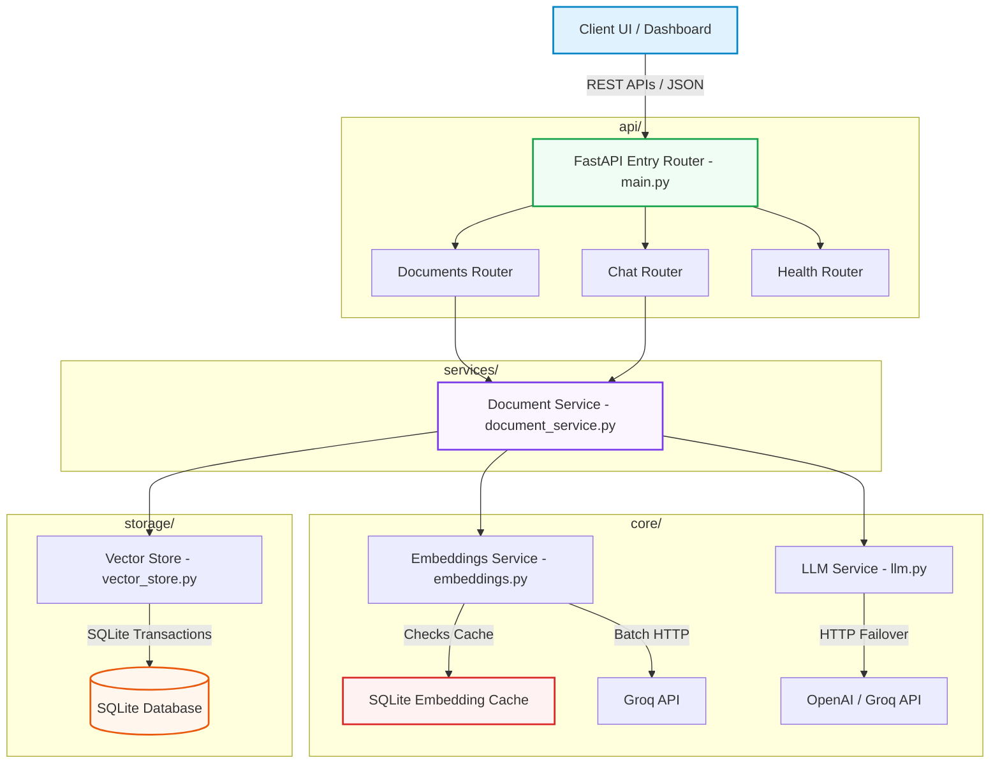

# 🧠 DataMind - Enterprise Document Intelligence & RAG Platform

> **A production-ready, highly optimized Retrieval-Augmented Generation (RAG) platform** designed to ingest, process, chunk, and index enterprise document repositories for real-time semantic search and conversational AI synthesis.

[](https://www.python.org/downloads/)
[](https://fastapi.tiangolo.com/)
[](https://www.sqlite.org/)
[](https://www.docker.com/)
[](https://opensource.org/licenses/MIT)

---

## 🎯 Architecture & Data Flow

DataMind is built strictly following **SOLID principles** and a modular clean architecture that guarantees decoupling between API routers, business logic pipelines, vector store databases, and embedding cache layers.

### System Architecture Topology



### End-to-End Pipeline Execution

1. **Ingest & Clean**: Multi-format files (PDF, DOCX, TXT, MD, CSV, JSON) are parsed and converted to raw text.
2. **Semantic Chunking**: A recursive character chunker divides text into overlapping segments of **500 characters (100 overlap)** to retain semantic boundaries.
3. **Transparent Embedding Cache**: Text segments are hashed using **SHA-256**. The cache table is queried; if hit, vectors are resolved in **0.1ms** locally. If missed, they are batch-submitted to Groq APIs and written to the cache database.
4. **Vector Persistence**: Document descriptors and segment embeddings are written to SQLite using native transactional parameters and cascade constraints.
5. **Dense Context retrieval**: Queries are embedded and compared against stored segments using **NumPy-optimized cosine similarity** in-memory.
6. **LLM Synthesis (RAG)**: The top-K dense matching segments are merged with file citations and chunk indices to construct high-context prompts. OpenAI/Groq synthesizes a highly accurate response.

---

## ✨ Production-Ready Features

*   🚀 **High-Speed SQLite Vector Store**: Full schema support for segments and caches, with database indexes for rapid search.
*   ⚡ **Persistent Embedding Caching**: Saves up to **90% of API token quotas** and delivers sub-millisecond local response times for repetitive chunk uploads.
*   🧠 **Overlapping Chunking**: High-density indexing segments keep context window sizes lightweight and accurate.
*   🎯 **Robust LLM Failover**: Dynamic failover from OpenAI (`gpt-4o-mini`) to Groq (`llama-3.1-8b-instant`), with degraded direct context fragment returns if all APIs fail.
*   🎨 **Stunning SaaS Dashboard UI**: Revamped using `Outfit` + `Inter` typography, glassmorphism card layouts, linear hover border glows, dynamic metrics dashboards, and responsive flexboxes.
*   🐳 **Container DevOps Suite**: Multi-stage, non-root `Dockerfile` configurations with persistent Docker Compose mounts.
*   🧪 **Complete Automated Pytest Suite**: Testing coverage spanning database CRUDs, segment searches, cache resolution, fallbacks, and FastAPI TestClients.

---

## 📁 explainable Folder Structure

```
datamind/                           # Main application package
├── api/                            # REST API routing
│   ├── chat.py                    # AI conversational synthetics
│   ├── documents.py               # Ingestion upload & search endpoints
│   ├── health.py                  # Live, ready, and health monitors
│   └── __init__.py
├── config/
│   ├── settings.py                # Centralized Pydantic-like settings manager
│   └── __init__.py
├── core/                           # Embeddings and LLM NLP layers
│   ├── embeddings.py              # Embedding caching & fallback calculations
│   ├── llm.py                     # OpenAI & Groq robust synthesis services
│   └── __init__.py
├── models/
│   ├── schemas.py                 # Pydantic schema validation structures
│   └── __init__.py
├── services/
│   ├── document_service.py        # Core RAG pipeline orchestrator
│   └── __init__.py
├── static/                         # Premium Visuals UI (HTML/CSS/JS)
│   ├── app.js
│   ├── index.html
│   └── style.css
├── storage/
│   ├── vector_store.py            # SQLite schemas and custom cosine searches
│   └── __init__.py
├── utils/
│   ├── helpers.py                 # File parsers and character chunking
│   ├── logging.py                 # Structured logs outputs
│   └── __init__.py
├── main.py                        # FastAPI startup coordinator & lifespan
└── __init__.py

tests/                              # Pytest Automated Test Suite
├── conftest.py                    # Clean testing setups, mocks, and fixtures
├── test_api.py                    # REST router integration tests
├── test_core.py                   # Cache and local models tests
└── test_storage.py                # Database schemas & retrieval logic
```

---

## 🛠️ Installation & Setup (5 Minutes)

### 1. Configure Environment Variables
Copy the configuration template and populate your API credentials:
```bash
cp .env.example .env
```
Edit `.env`:
```ini
GROQ_API_KEY=gsk_your_key_here
OPENAI_API_KEY=sk_your_key_here
```

### 2. Local Setup
Create a virtual environment and install packages:
```bash
python -m venv venv
source venv/bin/activate  # On Windows: venv\Scripts\activate
pip install -r requirements.txt
```

### 3. Launch App
Start the FastAPI server:
```bash
uvicorn datamind.main:app --host 0.0.0.0 --port 8080 --reload
```
Open your browser and navigate to `http://localhost:8080`.

---

## 🐳 Docker Deployment & Compose

### Docker Compose (Recommended)
Launch the platform with isolated compose mounts:
```bash
docker-compose up --build -d
```
Access the server at `http://localhost:8080`.

### Manual Docker Run
Build and run the container securely:
```bash
docker build -t datamind-rag:latest .
docker run -d -p 8080:8080 \
  -e GROQ_API_KEY="gsk_your_key" \
  -e OPENAI_API_KEY="sk_your_key" \
  -v datamind_vol:/app/data \
  datamind-rag:latest
```

---

## 🧪 Automated Testing

We maintain a comprehensive suite of unit and integration test cases that verify core business pipelines completely.

Run all tests:
```bash
pytest -v
```

Tests details:
*   `tests/test_storage.py`: Validates database schemas, cascades, index queries, and local cosine similarities.
*   `tests/test_core.py`: Validates SHA-256 caching efficiency, local fallbacks, and LLM failovers.
*   `tests/test_api.py`: Validates endpoints payloads, upload Multi-parts, and JSON schemas.

---

## 📖 API Documentation Catalogue

DataMind includes auto-generated interactive documentations accessible at:
- **Swagger UI**: `/api/docs`
- **ReDoc UI**: `/api/redoc`

### Route Catalog

| Method | Endpoint | Description | Request Payload Schema | Response Format |
| :--- | :--- | :--- | :--- | :--- |
| **GET** | `/api/health/` | System status and service checks | *None* | `HealthResponse` JSON |
| **POST** | `/api/documents/upload` | Ingest multiple files (Multipart) | `files: UploadFile` | `DocumentInfo` JSON |
| **POST** | `/api/documents/search` | Semantic search index segments | `SearchRequest` JSON | `SearchResponse` JSON |
| **GET** | `/api/documents/` | Get list of indexed documents | *None* | `List[DocumentInfo]` |
| **DELETE** | `/api/documents/{id}` | Purge document and all vector chunks | *None* | `{"message": "Success"}` |
| **POST** | `/api/chat/` | Ask conversational question | `ConversationMessage` JSON | `ConversationResponse` JSON |
| **GET** | `/api/documents/stats` | Stored metrics and analytics statistics | *None* | `DocumentStats` JSON |

---

## 🚀 Hugging Face Deployment

Deploy this platform directly to Hugging Face Spaces with Docker in seconds:

1. Create a new Space on Hugging Face.
2. Select **Docker** as the SDK (with Blank template).
3. Connect your Git repository or push this repository directly to Hugging Face.
4. Add `GROQ_API_KEY` and `OPENAI_API_KEY` inside your Space **Variables and secrets** panel.
5. Hugging Face will automatically run a multi-stage Docker build, expose the container on port `7860`, and host your professional DataMind dashboard online!

---

## 🔮 Future Architecture Roadmap

To scale this project for massive enterprise use cases:
1. **Dynamic Chunking**: Use Semantic Splitting (chunking by sentence semantic shifts rather than strict character counts).
2. **Pinecone/Weaviate Swapping**: Implement a Repository Pattern switch to store billions of vectors in cloud-scale vector databases.
3. **Advanced RAG Patterns**: Implement query rewriting, HyDE (Hypothetical Document Embeddings), and cross-encoder re-ranking.
4. **OAuth2 Security**: Add role-based authentication layers to protect private corporate indexes.
